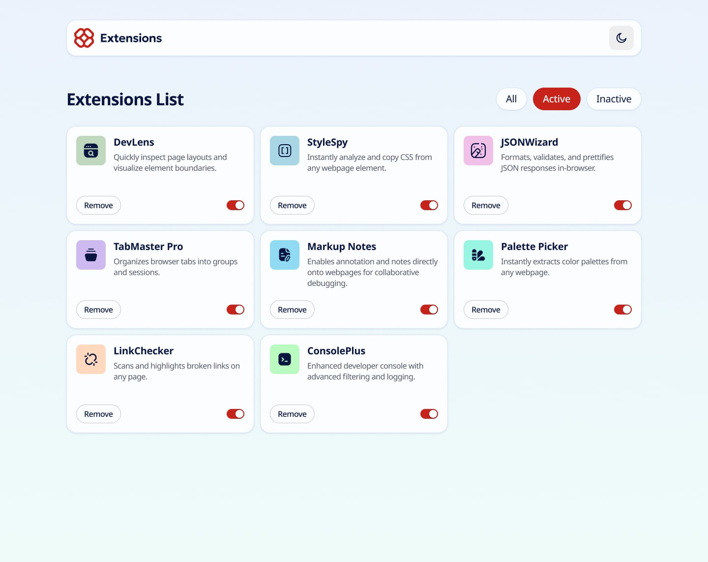

# Browser Extensions Manager UI

A responsive, modular interface that simulates a browser extension management panel. This UI allows users to view installed extensions, toggle their active state, or remove them entirely. Designed to demonstrate layout structure, visual theming, and interactive elements using HTML and CSS.

## 🌐 Live Demo  
[👉 View Online](https://vanta-zjm.github.io/browser-extensions-manager-ui/)

## 📸 Preview  

### Additional Views

## 🛠️ Built With
- HTML5
- CSS3 (Flexbox, Variables, Transitions)
- Javascript ES6
- Theme switching (Light/Dark mode)
- Button focus effects & visual consistency

## ✨ Key Features
- ✅ Card-based layout with icon, title, status switch, and remove button
- ✅ Interactive theme toggle (light/dark mode)
- ✅ Empty state display when no extension is found
- ✅ Responsive layout with clean spacing
- ✅ Focus-visible keyboard support on buttons

## 💡 What I Learned
- Structuring complex UIs using semantic HTML
- Implementing visual themes using CSS custom properties
- Creating accessible focus states and empty message handling
- Managing state logic purely via HTML/CSS transitions

## 📄 License  
MIT
